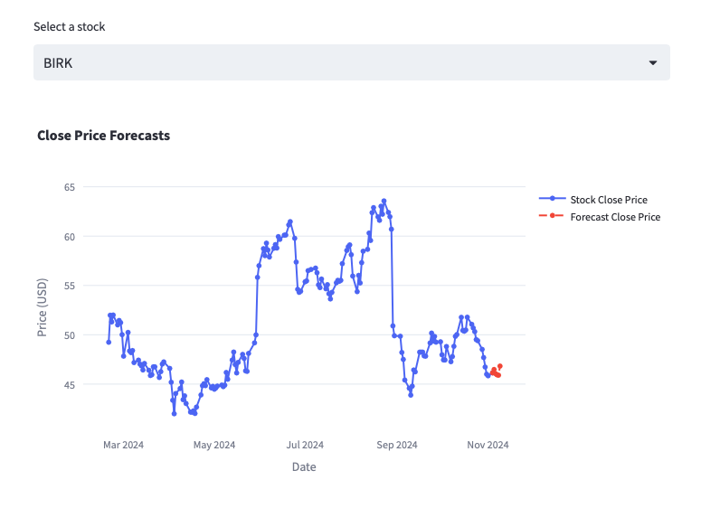

## Summary
For this project I created an ML pipeline to forecast the closing prices of stocks. This forecasting pipeline is scheduled to run daily using cron. Specifically, at 12am the latest stock data is gathered, cleaned, and pushed to the database. At 2 am a model training workflow is run which forecasts the stock closing price over the next 60 days.

My main focus was on building the pipeline rather than the accuracy of the forecast. To create the ML pipeline I used 3 tools: postgres, airflow, and docker and to visualize the results I used streamlit.

**Postgres**

Rather than using a csv to store the data from the api requests, I used a postgres database. Given the small size of the data, postgres is a bit overkill. However, I thought it would be useful to know how to set up a database from scratch.  

To assist me in the visualization of the database I used pgadmin4. 

**Airflow**

In short, airflow is a platform used to automate workflows.

Similarly to postgres, using airflow is a bit overkill because my workflows were not very complicated. But I wanted to get experience using airflow.

**Docker**

To simplify the process of setting up a database and to streamline the pipeline creation process I used docker. 

**Streamlit**

Finally, to visualize the results, I created a container to run a streamlit script to display the closing price forecasts.

**Model**

Since the goal of this project was to familiarise myself with this data engineering tools rather than creating the most accurate model, I chose to use a Prophet model.

As hypothesized, the model's forecasts were unimpressive.

**Next Steps**
* Incorporate pyspark into my data cleaning step.
* Improve the accruracy of the model.
* Incorporate monthly forecasts.
* Add pre-commits.

